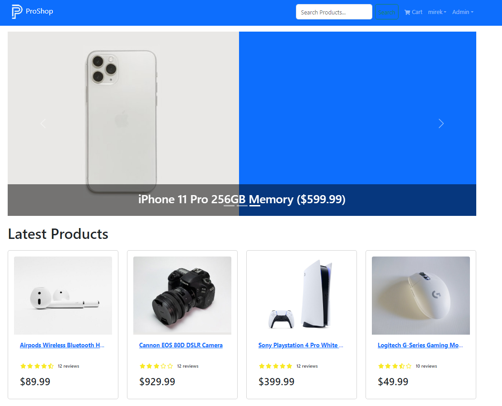

# MERN E-commerce Project



Welcome to the Pro Shop E-commerce project! This project is built using the MERN stack, providing users with a seamless shopping experience, user authentication features, and the ability to make payments through PayPal.

## Live Preview

Check out the live preview of the Pro Shop E-commerce project [here](https://pro-shop-ecommerce-pk8o.onrender.com/).

## Features

- User authentication: Users can sign up, log in, and manage their accounts.
- Product browsing: Browse through a wide range of products available in the store.
- Product details: View detailed information about each product, including images, descriptions, and prices.
- Shopping cart: Add products to the cart and manage items before checkout.
- PayPal integration: Securely make payments using PayPal for a smooth checkout experience.

## Technologies Used

- **MongoDB**: Database for storing product and user information.
- **Express.js**: Backend framework for building the RESTful API.
- **React**: Frontend library for building user interfaces.
- **Node.js**: Runtime environment for running JavaScript code on the server.
- **Redux**: State management library for managing application state.
- **Bootstrap**: Frontend framework for responsive and mobile-first web development.
- **PayPal API**: Integration for secure payment processing.

## Getting Started

clone and setup .env

```
NODE_ENV=development
PORT=5000
MONGO_URI=your_mongodb_uri
JWT_SECRET=your_jwt_secret
PAYPAL_CLIENT_ID=your_paypal_client_id
PAYPAL_APP_SECRET=app_secret
PAYPAL_API_URL=https://api-m.sandbox.paypal.com
```
